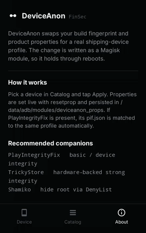
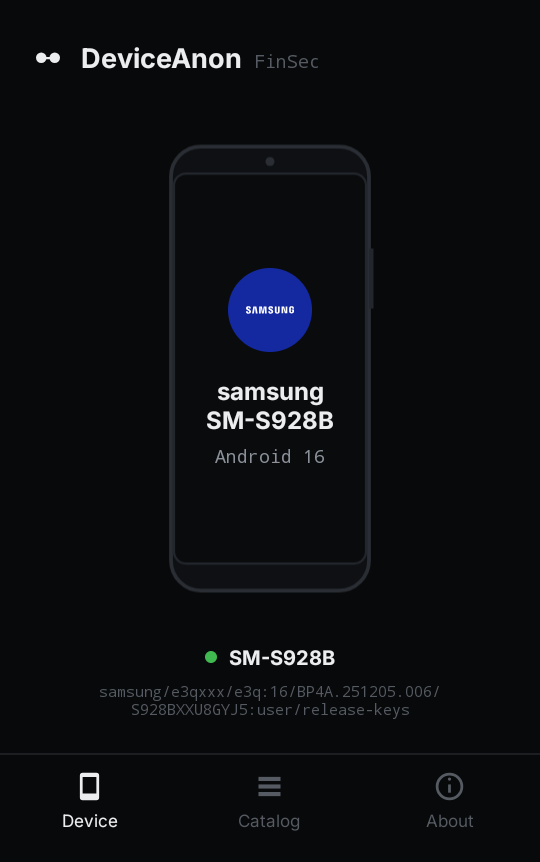
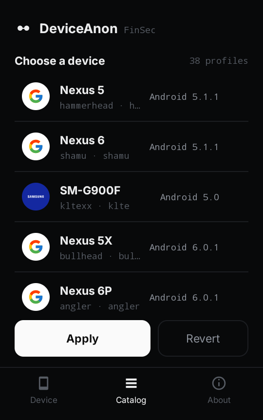
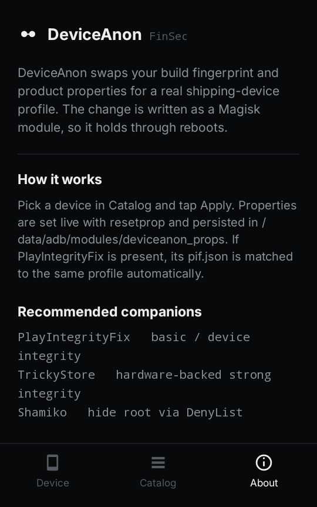

<div align="center">

# DeviceAnon

Swap your Android build fingerprint and product properties for a real
shipping-device profile. Applied as a Magisk module, so it survives reboots.

[](https://github.com/Finsec-lab/DeviceAnon/actions/workflows/build.yml)
[](https://github.com/Finsec-lab/DeviceAnon/releases)

[](LICENSE)



</div>

<div align="center">
  
  
  
</div>

## What it is

A small, root-only tool that rewrites the properties apps use to identify your
device — `ro.product.*` across every partition plus the build fingerprint — and
pins them to a coherent, real device profile. It ships with 38 profiles from
Android 5.0 through 16 (Pixel/Nexus and Samsung Galaxy), and matches
PlayIntegrityFix's `pif.json` to the same profile when that module is present.

The common reason an app refuses to install or flags a device is a *mismatch*:
an old model string on a newer OS, or a custom ROM leaking `lineage_*` build
tags. DeviceAnon replaces the whole identity with one normal, shipping phone.

## Requirements

- Root via Magisk or KernelSU
- Runs on Android 5.0 – 16

## Install

Grab the APK from [Releases](https://github.com/Finsec-lab/DeviceAnon/releases),
or:

```
adb install -r DeviceAnon-v1.0.apk
```

Open the app, grant root, pick a device in **Catalog**, tap **Apply**.

## Build

Standard Gradle project — builds on any host (Gradle fetches the right `aapt2`
for your platform):

```
git clone https://github.com/Finsec-lab/DeviceAnon
cd DeviceAnon
./gradlew assembleRelease
```

Output: `app/build/outputs/apk/release/`.

## How it works

Applying a profile writes a Magisk module and enforces it on every boot:

```
/data/adb/modules/deviceanon_props/
  module.prop      module metadata
  system.prop      ro.product.* / ro.build.fingerprint, read at boot
  service.sh       resetprop enforcement (late_start)
```

Properties are also set live with `resetprop`, so the change takes effect
without a reboot. If `playintegrityfix` is installed, its `pif.json` is rewritten
to match the chosen profile. Any older spoof modules are disabled to avoid
conflicts.

## Profiles

Profiles live in
[`app/src/main/assets/profiles.json`](app/src/main/assets/profiles.json):

```json
{
  "label": "Pixel 8 Pro — Android 14",
  "brand": "google",
  "manufacturer": "Google",
  "model": "Pixel 8 Pro",
  "name": "husky",
  "device": "husky",
  "fingerprint": "google/husky/husky:14/UQ1A.240105.004/11206848:user/release-keys",
  "security_patch": "2024-01-05",
  "release": "14",
  "sdk": "34"
}
```

Add your own by editing that file — the list and the home screen pick up new
entries automatically, and the hero render adapts to the form factor
(phone / foldable / flip / tablet). An optional `"image"` URL on a profile loads
a custom render over the network, falling back to the vector if it's offline.

Play Integrity validity changes over time: Google rotates which fingerprints
still pass. If a profile stops passing, refresh its fingerprint from
[Google's factory images](https://developers.google.com/android/images) or
[PlayIntegrityFix](https://github.com/chiteroman/PlayIntegrityFix) and edit the
JSON.

## Works well with

- [PlayIntegrityFix](https://github.com/chiteroman/PlayIntegrityFix) — basic / device integrity
- [TrickyStore](https://github.com/5ec1cff/TrickyStore) — hardware-backed strong integrity
- [Shamiko](https://github.com/LSPosed/LSPosed.github.io/releases) — hide root via DenyList

## Credits

- Typeface: [Inter](https://rsms.me/inter/) (SIL Open Font License)
- Brand marks: [Simple Icons](https://simpleicons.org) (CC0). Trademarks belong to their respective owners and are used here only to identify the device being emulated.

## License

[MIT](LICENSE) © FinSec Lab

For research, development, and privacy on devices you own. You are responsible
for complying with the terms of any service you use it with.
