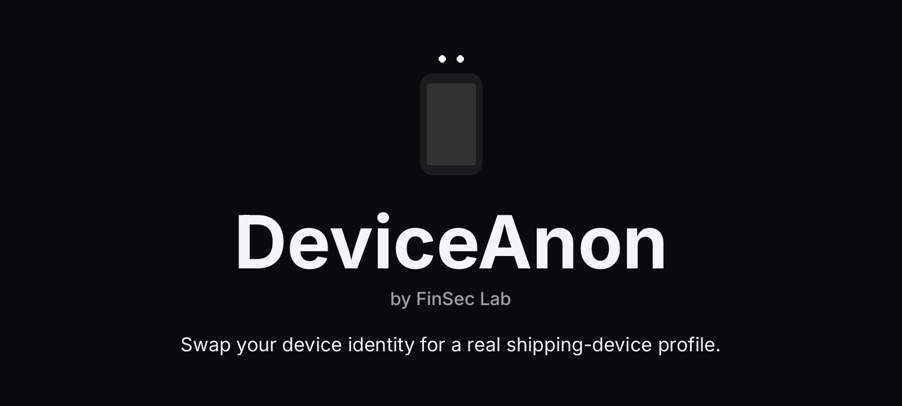
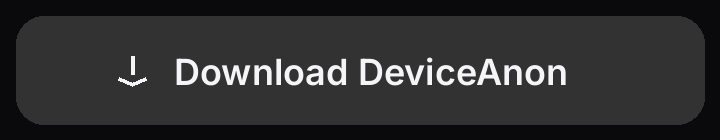
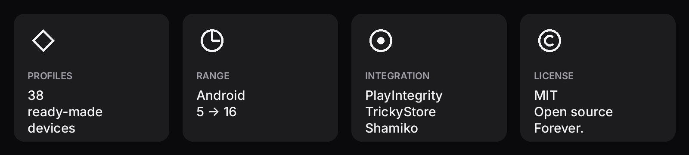
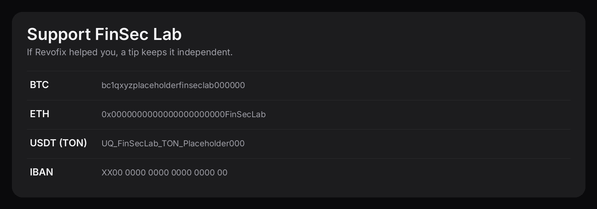

<p align="center">
  
</p>

<p align="center">
  <a href="https://github.com/Finsec-lab/DeviceAnon/releases/latest">
    
  </a>
</p>

<p align="center">
  
</p>

<p align="center">
  
</p>

<p align="center">
  
</p>

### Build
```
git clone https://github.com/Finsec-lab/DeviceAnon
cd DeviceAnon
./gradlew assembleRelease
```

<p align="center">
  <a href="https://t.me/FinSecLab">Telegram</a>
  &nbsp;·&nbsp;
  <a href="https://github.com/Finsec-lab">GitHub</a>
  <br/><br/>
  <sub>MIT — © FinSec Lab · For devices you own.</sub>
</p>
